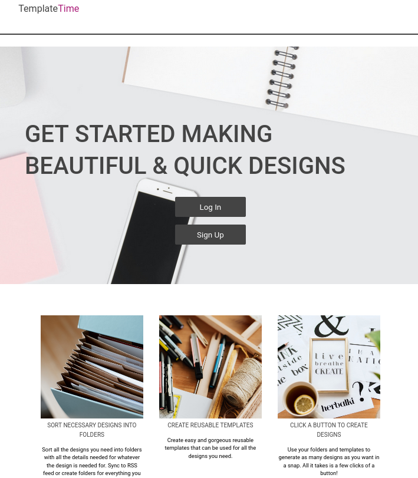
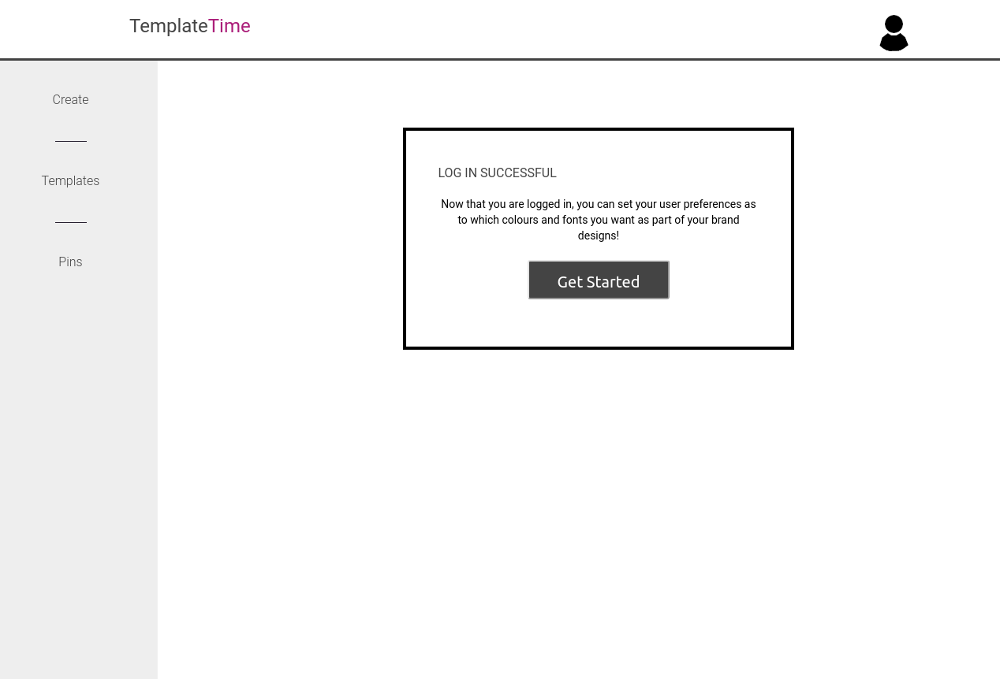
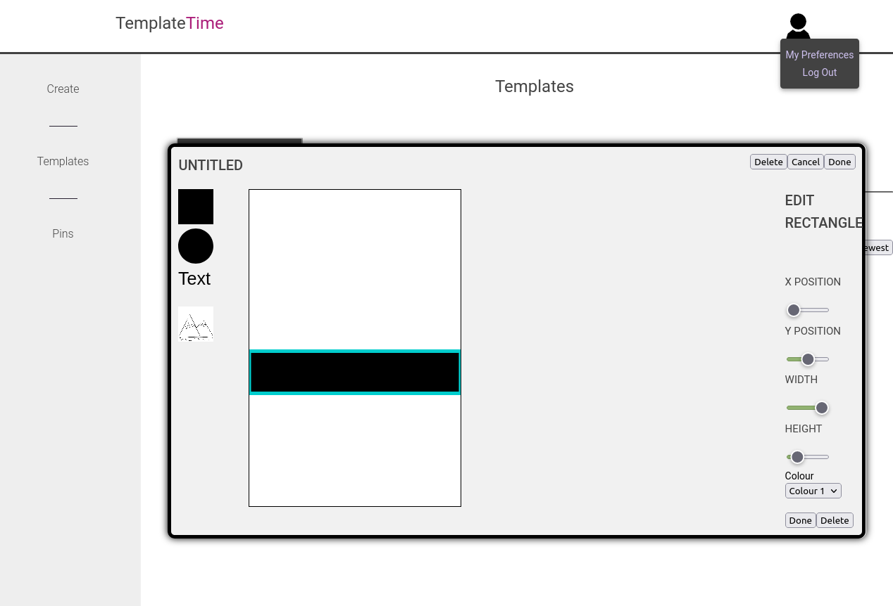

# Design Generator

This application is a design generator that helps business owners, bloggers and more generate designs to help promote their business.  Users can create folders and templates that can be combined to quickly and easily create new designs.

The project uses firebase for the database and authentication. The authentication is done with email and password. The email is used as an id to get and save the user’s information as they use the application.

The application has a preferences component that allows the user to view and edit their preferences based on the fonts and colours they use in their business or blog.

The application also has a template component.  The user can create and edit templates with basic shapes, text and image options. These templates are used to generate the final design. The template component was built using a canvas element.

The application has a folder component.  This component allows the user to create and edit folders, which store post or product specific information. The folders are made of a name, text options, images and categories.  

The create component of the application combines the folders and creates designs for them using the templates generated. These final designs can be downloaded as images to be used in other applications.

https://pinning-app.web.app/create

## Screenshots

The home page.

The screen when you first log in after sign up.

Form for creating a new template.

Designing a new template.

